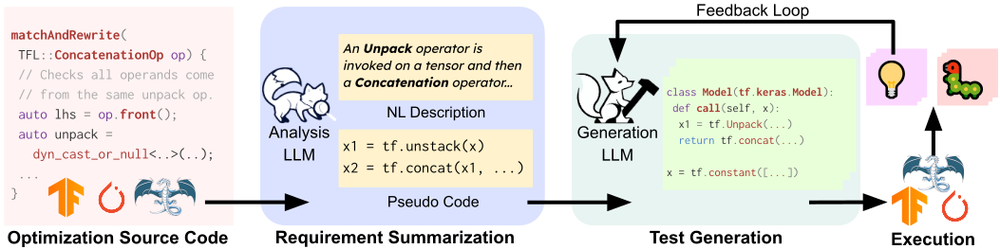

#  WhiteFox: White-box Compiler Fuzzing Empowered by Large Language Models

<p align="left">
    <a href="https://arxiv.org/abs/2310.15991">
</p>

> [!IMPORTANT]
> We are keeping improving the documents and adding more implementation details. Please stay tuned at [README-DEV.md](README-DEV.md) for more information.



## About

* 🦊**WhiteFox** is the first white-box compiler fuzzer using LLMs with source-code information to test compiler optimization.
* WhiteFox adopts a dual-model framework: (i) an analysis LLM examines the low-level optimization source code and produces requirements on the high-level test programs that can trigger the optimization; (ii) a generation LLM produces test programs based on the summarized requirements.

> [!IMPORTANT]
> * **WhiteFox** has detected **96** bugs 🐛 in the PyTorch Inductor, Tensorflow XLA, TensorFlow Lite and LLVM, with 80 confirmed as previously unknown and **61** of them are fixed.

We provide a list of confirmed bug reports in [bugs](bugs.csv).

## 🔨 Getting Started

### Prerequisites

1. Python version >= 3.9.0 (It must support f-string.)
    - highly recommend to use Python 3.9
2. Check our dependent python libraries in requirements.txt and install with:
    - pip install -r requirements.txt
3. Install StarCoder
    - Please follow the instructions in [StarCoder](https://huggingface.co/bigcode/starcoder).

### Running WhiteFox

#### Step 1: Request Summarization

The prompts for NL generation are in [Prompts](Prompts) with the format `Prompts/{compiler}/src2req/{name}.txt`.

If you want to generate the prompt by you own, take the prompt for `torch-inductor` as an example:

```bash
bash scripts/whitefox-torch-prompt-gen-src2req.sh
# Or
bash scripts/whitefox-torch-prompt-gen-src2req.sh {generated-prompt-dir}
```
The generated prompts will be in `Prompts-generated` by default.

After getting the prompts, you can run the following command to generate the requirements:

```bash
python gpt4.py --prompt-dir=Prompts/torch-inductor/src2req \ 
    --outdir=Requirements/torch-inductor/req \
    --temperature=0.0 \
    --batch-size=1
```

Before running the command, please put your OpenAI API key in `openai.key`:

```bash
echo {api_key} > openai.key
```

#### Step 2: Test Generation

First, you need to generate the prompts for the test generation based on the requirements:

```bash
bash scripts/whitefox-torch-prompt-gen-req2test.sh 

# Or
bash scripts/whitefox-torch-prompt-gen-req2test.sh {req-dir} {generated-prompt-dir}
```
The generated prompts will be in `Prompts-generated` by default.


Or you can use the prompts we generated in [Prompts](Prompts) with the format `Prompts/{compiler}/req2test/{name}.txt`.

We leverage [StarCoder](https://huggingface.co/bigcode/starcoder) to generate the tests based on the prompts.


##### [Option 1]: Local Mode (Recommended!)

We recoomend to use the local mode to generate the tests, which utilizes [vllm](https://github.com/vllm-project/vllm).

You can execute the following command to generate the tests:

```bash
python starcoder_gen.py --hf-home={path-to-huggingface} --hf-cache={path-to-huggingface-cache} --prompt-dir=Prompts/torch-inductor/req2test ----output-dir=starcoder-generated --num=10 
```

The generated tests will be in `starcoder-generated`.

##### [Option 2]: Server Mode

You can execute the following command to generate the tests:

1. Run the starcoder server:

```bash
python starcoder_service.py --hf-home={path-to-huggingface} --hf-cache={path-to-huggingface-cache} --prompt-dir=starcoder-prompts --outdir=starcoder-generated --device='cuda:0' --num=10 --batch_size=10
```

2. Put the prompts in `starcoder-prompts` and the generated tests will be in `starcoder-generated`.

```bash
mkdir starcoder-prompts/torch-inductor
cp -r Prompts/torch-inductor/req2test starcoder-prompts/torch-inductor/
```

#### Step 3: Test Execution

You can execute the following command to execute the tests:

```bash
cd torch-exec && python run_torch.py --input-dir=../starcoder-generated/torch-inductor-generated/step1 --res-dir=_results-torch
```

The output of the execution will be in `torch-exec/_results-torch`.
